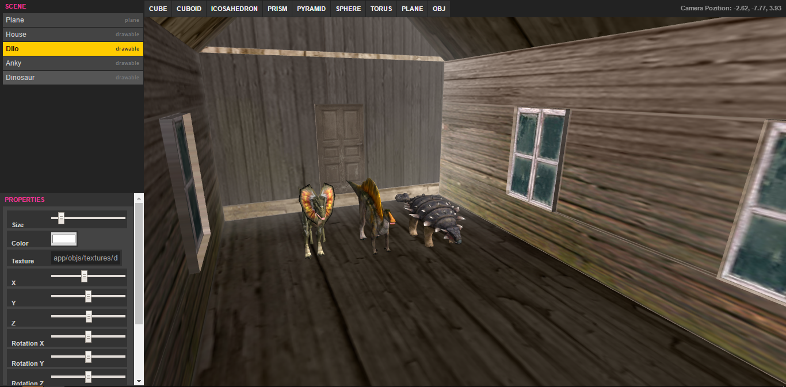
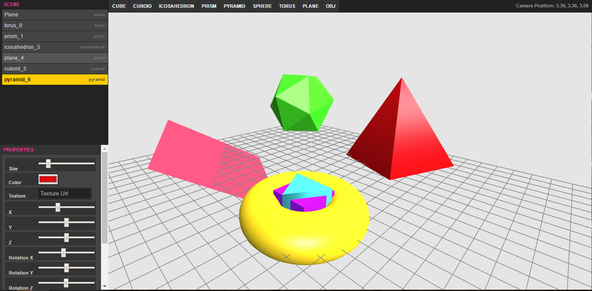

#Webgl editor#
3d editor on the web

### Links
Double click the scene to enter in free flying mode (Esc for exit).
 - [Empty scene demo](https://rawgit.com/ichko/WebGLEditor/master/index.html)
 - [Dinosaurs example demo](https://rawgit.com/ichko/WebGLEditor/master/example.html)

# Example code
```javascript
app.lib.init(function init(lib){
	app.inputHandler.lockPointer(lib.gl.canvas);

	lib.scene.push(new app.plane({
		size: 1,
		ctx: lib.gl.ctx,
		width: 30,
		height: 30,
		material: {color: [0.3,0.3,0.3]},
		wireframe: true,
		name: 'Plane'
	}));


}, function update(lib){
	lib.gl.clear();
	lib.cameraControl.update();
	lib.renderer.drawScene(lib.scene, lib.camera);
});
```

# Primitive objects
 - Cube
 - Cuboid
 - Icosahedron
 - Plane
 - Prism
 - Pyramid
 - Sphere
 - Torus
 - Obj file

# Screenshots


